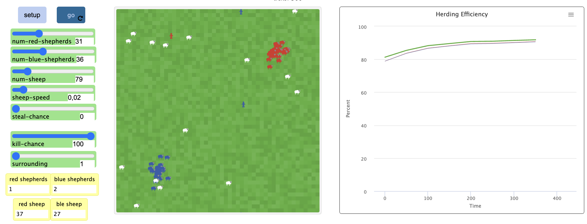

## Комп'ютерні системи імітаційного моделювання
## СПм-22-6, **Карачевцев Данило Дмитрович**
### Лабораторна робота №**2**. Редагування імітаційних моделей у середовищі NetLogo

 

### Варіант 9, модель у середовищі NetLogo:
[Sheperds](http://www.netlogoweb.org/launch#http://www.netlogoweb.org/assets/modelslib/Sample%20Models/Biology/Shepherds.nlogo).
Поділити вівець на два різних стада, відповідно і пастухів на дві різні організації. Пастухи повинні збирати тільки "своїх" вівець. Додати відключаєму можливість збирати "чужих" вівець, які після потрапляння до нового стада змінюють свою приналежність.

 

### Внесені зміни у вихідну логіку моделі, за варіантом:

**Створення двух організацій** на ігровому полі при ініціалізації моделі - спочатку був лише один вид пастухів. 

Замість
<pre>
breed [shepherds shepherd]
</pre>
було створено 2 агента пастухів:
<pre>
breed [shepherds1 shepherd1]
breed [shepherds2 shepherd2]
</pre>
До списку глобальних змінних було додано:
<pre>
blue-sheep                  ;; кількість синіх овець
red-sheep                   ;; кількість червоних овець
blue-herding-efficiency     ;; ефективність групування синіх овець
red-herding-efficiency      ;; ефективність групування червоних овець
</pre>

Тепер існують `shepherds1-own` та `shepherds2-own`, де до агентів додано властивості, що визначають координати їхніх загонів
<pre>
shepherds1-own
[
  carried-sheep
  found-herd?
  homex
  homey
]
shepherds2-own
[
  carried-sheep
  found-herd?
  homex
  homey
]
</pre>
Процедура **setup** змінилася

Тепер ініціалізуються два види пастухів з координатами їх загонів (15, 15) для червоних та (-15, -15) для синіх
<pre>
set-default-shape shepherds1 "person"
set-default-shape shepherds2 "person"

create-shepherds1 num-red-shepherds
[
  set homex 15
  set homey 15
  set color red
  set size 1.5
  set carried-sheep nobody
  set found-herd? false
  setxy random-xcor random-ycor 
]

create-shepherds2 num-blue-shepherds
[ 
  set homex -15
  set homey -15
  set color blue
  set size 1.5
  set carried-sheep nobody
  set found-herd? false
  setxy random-xcor random-ycor 
]
</pre>

Процедура **go** також має значні зміни

Раніше пастух продовжував шукати вівцю, доки не знаходив її, а потім залишав її на відкритому просторі біля іншої вівці. Тепер же пастухи діють по-іншому: вони шукають вівцю лише тоді, коли вона відійде від стада на п'ять ділянок. Після того, як вівця знайдена, пастух несе її прямо до загону, розміщує її там та відшукує наступну загублену вівцю.
<pre>
ask shepherds1
  [ 
    ifelse carried-sheep = nobody
    [ 
      ifelse sqrt(((homex - xcor) ^ 2) + ((homey - ycor) ^ 2)) > 5
      [search-for-sheep]
      [
        wiggle
        fd 1
      ]
    ]
    [ 
      ifelse found-herd?
      [ find-empty-spot ]
      [ find-new-herd ] 
    ]
    if carried-sheep != nobody
    [ ask carried-sheep [ move-to myself ] ] 
  ]
</pre>
На завершення процедури відбувається підрахунок кількості овець.
<pre>
set blue-sheep count sheep with [color = blue]
set red-sheep count sheep with [color = red]
</pre>

Процедура **search-for-sheep**

 Тепер пастух оцінює колір вівці, і підбирає її, якщо вона біла або її колір відповідає його кольору. Або може забрати вівцю протилежного кольору з вирогідністю, що задана новим вхідним параметром `steal-chanсe`
<pre>
to search-for-sheep
  wiggle
  fd 1
  let personal-color color
  set carried-sheep one-of sheep-here with [not hidden? and (color = personal-color or color = white or (random 99) + 1 <= steal-chance)]
  if (carried-sheep != nobody)
  [
    ask carried-sheep
    [ 
      set color personal-color
      hide-turtle
    ]
    fd 1 
  ]
end
</pre>

Процедура **find-new-herd**

Тепер пастух рухається безпосередньо до загону, користуючись `face`. Вважається, що він знайшов отару, коли опиняється у радіусі двох ділянок від загону.
<pre>
to find-new-herd
  let distance-to-target sqrt(((homex - xcor) ^ 2) + ((homey - ycor) ^ 2))
  face patch homex homey
  fd 1
  if distance-to-target <= 2
    [ set found-herd? true ]
end
</pre>

У процедурі **find-empty-spot** внесено зміни через модифікацію алгоритму руху пастухів. Це дозволить пастуху виявити вільну позицію та залишити загін після того, як він пересуне вівцю.
<pre>
rt random 360
fd 1
</pre>

У процедурі **calculate-herding-efficiency** обчислюються ефективності групування синіх та червоних овець.
<pre>
set red-herding-efficiency (sheepless-neighborhoods / (count patches with [not any? sheep-here with [color = red]])) * 100
set blue-herding-efficiency (sheepless-neighborhoods / (count patches with [not any? sheep-here with [color = blue]])) * 100
</pre>

 

### Внесені зміни у вихідну логіку моделі, на власний розсуд:

**Введено можливість ліквідації пастуха ворожої команди.**

Користувач може налаштувати цю ймовірність через інтерфейс симуляційного середовища, використовуючи слайдери для `kill-chanсe` та `surrounding`, які застосовуються у логіці пастуха:

<pre>
if count shepherds2-own neighbors >= surrounding and ((random 99) + 1 <= kill-chanсe)
[
  die
]
</pre>

<pre>
if count shepherds1-own neighbors >= surrounding and ((random 99) + 1 <= kill-chanсe)
[
  die
]
</pre>

Ці зміни реалізовані у фінальній частині алгоритму обробки поведінки кожного пастуха.
Якщо у восьми сусідніх клітинах навколо пастуха присутня кількість ворожих пастухів, яка дорівнює або перевищує значення `surrounding`, і при цьому настає шанс `kill-chance`, то пастух буде усунений.

Скріншот моделі в процесі симуляції:

Фінальний код моделі та її інтерфейс доступні за [посиланням](Lab2Shepherds.nlogo). 
 

## Обчислювальний експеримент

### Вплив шансу вбивства на загальну ефективність групування
Досліджується, як впливає можливість усунення пастуха супротивника на ефективність групування. Експерименти здійснюються за участі 25 пастухів в кожній команді та 68 вівцями, які рухаються зі швидкістю 0.02 і не можуть бути викрадені. Проводиться 20 симуляцій з кроком зміни імовірності усунення 5, кожна з яких триває 3000 циклів. Аналізується максимальне, мінімальне, середнє та кінцеве значення ефективності групування.

Статичні параметри:
- **sheep-speed**: 0.02
- **steal-chance**: 0
- **num-sheep**: 68
- **num-blue-shepherds**: 25
- **surrounding**: 2
- **num-red-shepherds**: 25

<table>
    <tr>
        <td>kill-chance</td>
        <td>[final]</td>
        <td>[min]</td>
        <td>[max]</td>
        <td>[mean]</td>
    </tr>
    <tr>
        <td>1</td>
        <td>95,53</td>
        <td>82,67</td>
        <td>97,39</td>
        <td>95,25</td>
    </tr>
    <tr>
        <td>5</td>
        <td>95,02</td>
        <td>82,87</td>
        <td>96,65</td>
        <td>94,83</td>
    </tr>
    <tr>
        <td>10</td>
        <td>94,63</td>
        <td>83,10</td>
        <td>96,87</td>
        <td>94,88</td>
    </tr>
    <tr>
        <td>15</td>
        <td>95,34</td>
        <td>83,91</td>
        <td>97,39</td>
        <td>95,16</td>
    </tr>
    <tr>
        <td>20</td>
        <td>94,63</td>
        <td>83,34</td>
        <td>97,62</td>
        <td>94,84</td>
    </tr>
    <tr>
        <td>25</td>
        <td>94,42</td>
        <td>83,78</td>
        <td>96,88</td>
        <td>94,76</td>
    </tr>
    <tr>
        <td>30</td>
        <td>94,16</td>
        <td>83,39</td>
        <td>96,64</td>
        <td>94,42</td>
    </tr>
    <tr>
        <td>35</td>
        <td>94,47</td>
        <td>83,62</td>
        <td>96,84</td>
        <td>94,35</td>
    </tr>
    <tr>
        <td>40</td>
        <td>94,70</td>
        <td>83,68</td>
        <td>96,88</td>
        <td>94,76</td>
    </tr>
    <tr>
        <td>45</td>
        <td>92,97</td>
        <td>83,94</td>
        <td>96,33</td>
        <td>94,16</td>
    </tr>
    <tr>
        <td>50</td>
        <td>93,72</td>
        <td>83,66</td>
        <td>96,60</td>
        <td>94,66</td>
    </tr>
    <tr>
        <td>55</td>
        <td>94,03</td>
        <td>83,54</td>
        <td>97,43</td>
        <td>94,50</td>
    </tr>
    <tr>
        <td>60</td>
        <td>93,51</td>
        <td>82,95</td>
        <td>97,35</td>
        <td>94,05</td>
    </tr>
    <tr>
        <td>65</td>
        <td>93,72</td>
        <td>83,71</td>
        <td>96,68</td>
        <td>94,17</td>
    </tr>
    <tr>
        <td>70</td>
        <td>93,91</td>
        <td>82,72</td>
        <td>96,60</td>
        <td>94,17</td>
    </tr>
    <tr>
        <td>75</td>
        <td>93,15</td>
        <td>83,54</td>
        <td>97,30</td>
        <td>94,32</td>
    </tr>
    <tr>
        <td>80</td>
        <td>94,54</td>
        <td>83,23</td>
        <td>97,31</td>
        <td>94,32</td>
    </tr>
    <tr>
        <td>85</td>
        <td>93,55</td>
        <td>83,58</td>
        <td>97,07</td>
        <td>94,35</td>
    </tr>
    <tr>
        <td>90</td>
        <td>93,83</td>
        <td>83,19</td>
        <td>97,46</td>
        <td>94,33</td>
    </tr>
    <tr>
        <td>95</td>
        <td>94,58</td>
        <td>82,96</td>
        <td>96,64</td>
        <td>94,28</td>
    </tr>
    <tr>
        <td>100</td>
        <td>93,04</td>
        <td>83,27</td>
        <td>96,46</td>
        <td>94,16</td>
    </tr>
</table>

Таблиця чітко демонструє, що з ростом ризику нападу, пастухам ускладнюється догляд за своїми стадами. Це означає, що агресивні дії негативно впливають на підтримання стад.